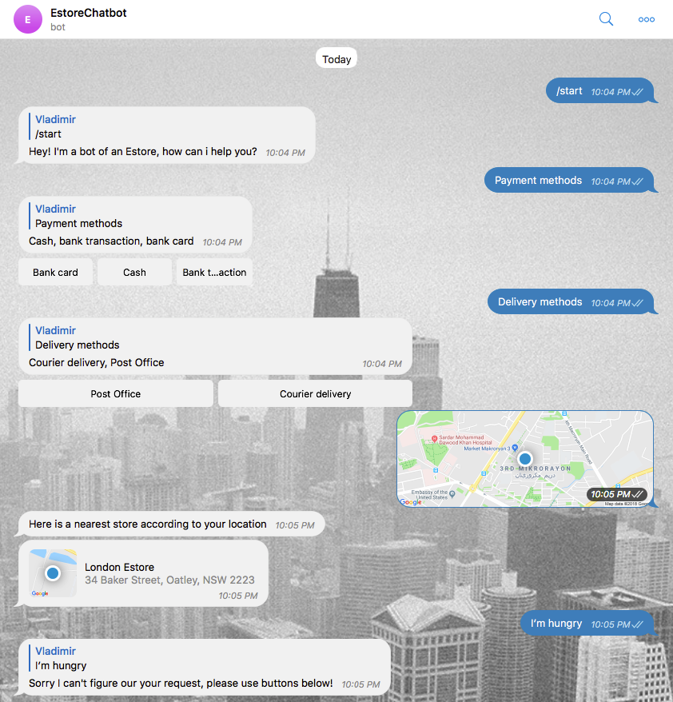

# Estore telegram bot
A telegram bot written with powerful python telegram library [https://github.com/eternnoir/pyTelegramBotAPI](https://github.com/eternnoir/pyTelegramBotAPI).

## Run an estore telegram bot
Run script from the root directory of the project:
```bash
~ python bot.py
```

## Demo


## Contributing

### Setup
- clone the repository
- configure Git for the first time after cloning with your name and email
  ```bash
  git config --local user.name "Volodymyr Yahello"
  git config --local user.email "vjagello93@gmail.com"
  ```
- `python3.6` is required to run the code
- run `pip install -r requirements.txt` to install all required python packages
